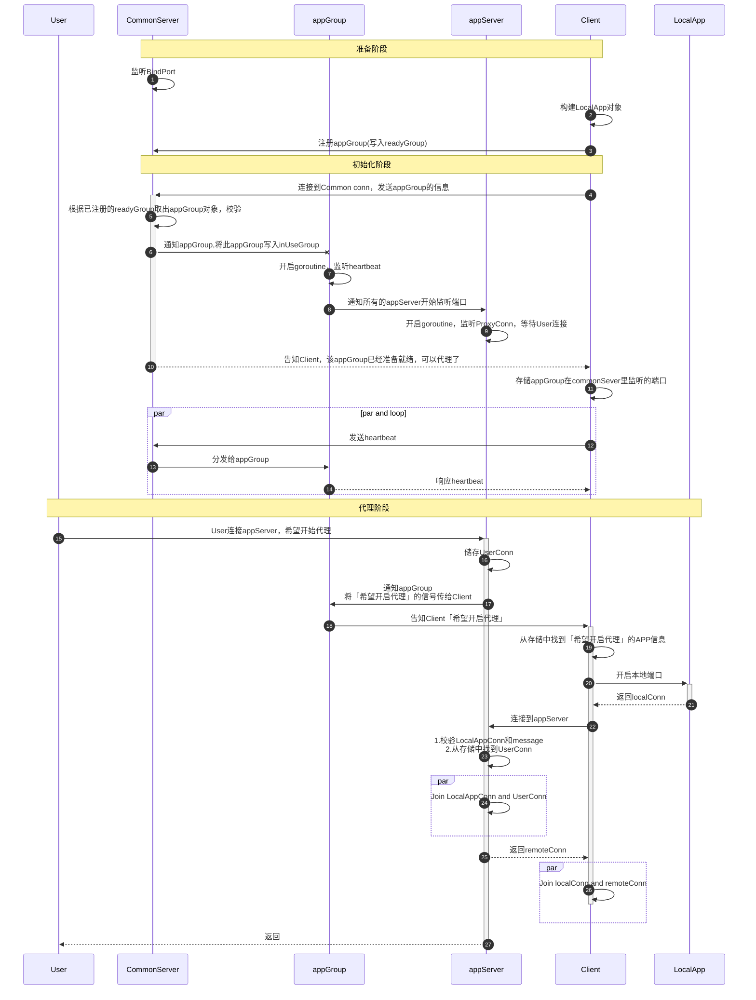

# nat-traversal-platform
内网穿透平台，支持多主机多应用穿透

## 时序图



- User：外部用户
- CommonServer：负责 appGroup 的初始化，具体功能为 `控制信息的通讯` 和 `分发heartbeat` 。
- appGroup：app 组。一个用户可能需要有多个 app 需要代理。每个用户使用一个 appGroup。不允许重名。
- appServer：每个需要代理的 app
- Client：转发来自代理服务器的信息给 LocalApp
- LocalApp：处于内网的被代理的、提供实际业务功能的 app。


## types

```go
type GroupInfo struct {
	Name string
	Apps map[string]*AppInfo
}

type CommonServer struct {
	Name       string
	bindAddr   string
	listenPort int64

	listener *Listener

	readyLock  sync.Mutex // protect follow
	readyGroup map[string]*GroupInfo

	// 为了在断开连接时，快速找到并关闭appGroup
  // CommonServer与appGroup互相引用
	inUseLock  sync.Mutex           // protect follow
	inUseGroup map[string]*appGroup // 对应appGroup的commonServer
	inUseConn  map[*Conn]*appGroup  // 对应appGroup的clientConn
}

type appGroup struct {
	name          string
	wantProxyApps map[string]*AppInfo
	onProxyApps   map[string]*appServer // appServer which is listening its own port
	heartbeatChan chan *Message         // when get heartbeat msg, put msg in
	userConnMap   sync.Map              // map[appServerName]UserConn
	clientConn    *Conn
	commonServer  *CommonServer
}

type appServer struct {
	name     string
	status   ServerStatus
	listener *Listener
}
```
